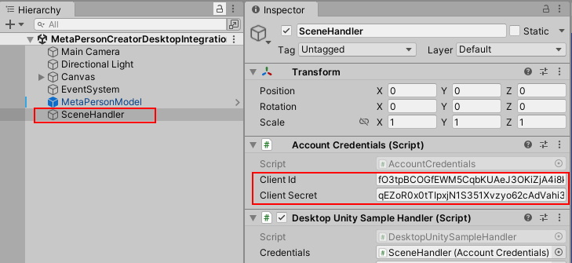

# MetaPerson Creator - Integration Into Windows And MacOS Unity Application 
This sample demonstrates how to integrate the [MetaPerson Creator](https://metaperson.avatarsdk.com/) web page into **Windows** or **macOS** application and export an avatar from it.

**Note:** a special WebView component is required to show web pages inside a unity application. This sample uses [Vuplex Web View](https://store.vuplex.com/webview/windows-mac) plugin that is paid.
You can choose any other 3rd party solution with WebView component.

## Getting Started
1\. Open the sample scene. 

You can get this sample via Unity Package Manager or clone the repository and run the sample from it.

### Get the sample via Package Manager.

 * Add a new Scoped Registry to *Project Settings -> Package Manager*. This registry is required to import the [glTFast](https://github.com/atteneder/glTFast) package as a dependency.

```json
"scopedRegistries": [
  {
    "name": "OpenUPM",
    "url": "https://package.openupm.com",
    "scopes": [
      "com.atteneder"
    ]
  }
]
```


 * Open *Window->Package Manager*, click on the **+** icon in the top left corner and select **Add Package From Git URL**.
 


 * Provide the Git URL of this project:

`https://github.com/avatarsdk/metaperson-loader-unity.git`

 * Import **MetaPerson Creator Desktop Integration Sample** as well.


 * Open the `Assets/Samples/MetaPerson Loader/0.1.1/MetaPerson Creator Desktop Integration Sample/Scenes/MetaPersonCreatorDesktopIntegrationSample.unity` scene.

### Get the sample from the repository.

 * Clone this repository to your computer.

 * Open the project from `metaperson-loader-unity\Samples~\MetaPersonCreatorDesktopIntegrationSample` directory in Unity 2021.3.19f1 or a newer.

 * Open the `Assets/AvatarSDK/MetaPerson/DesktopIntegrationSample/Scenes/MetaPersonCreatorDesktopIntegrationSample.unity` scene.
 
2\. Import [Vuplex plugin](https://store.vuplex.com/webview/windows-mac) into the project.

3\. Find **SceneHandler** object and provide your [Account Credentials](#account-credentials).



4\. Run the scene.

5\. Press the **Get Avatar** button. MetaPerson Creator page will be shown.

6\. Select any of the sample avatars or create your own, customize it and press **Export** button.


7\. The avatar will be exported and added to the scene.


## Account Credentials

## How It Works

## Export Parameters

## Support
If you have any questions or issues with the plugin, please contact us <support@avatarsdk.com>.
